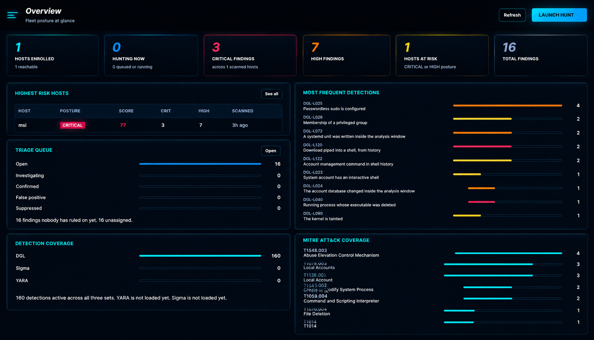
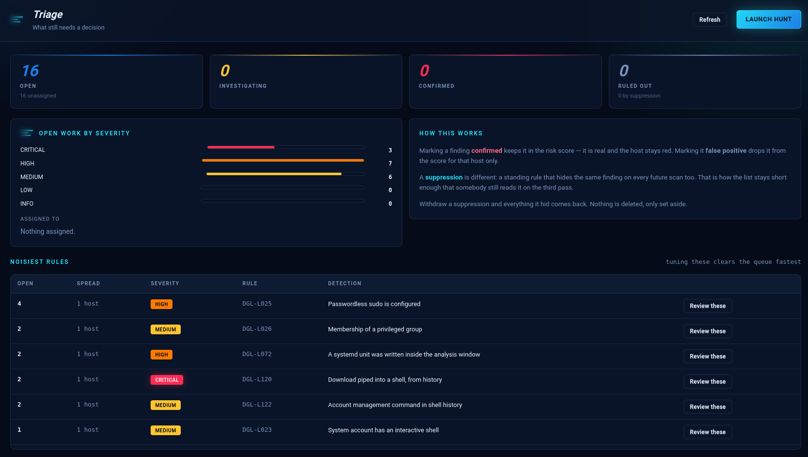
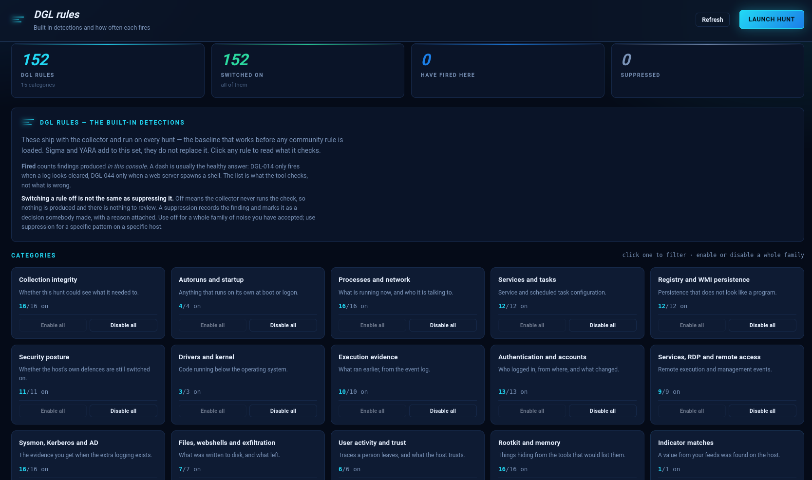
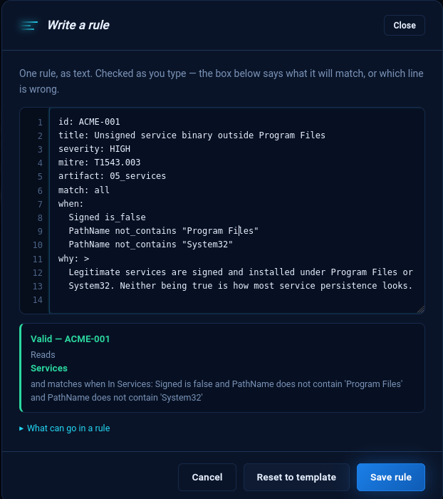
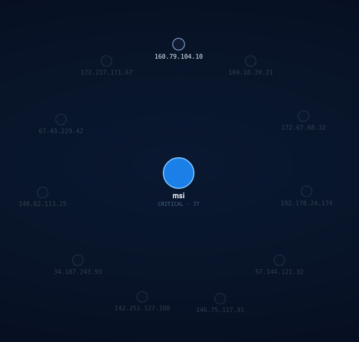

<div align="center">

# Douglas-042 HEADQUARTERS
<h1>
  
  Douglas-042
</h1>
**Agent-based threat hunting and incident response, for estates that do not have an EDR.**

Sweep a fleet of Windows and Linux hosts for signs of compromise, decide what
actually matters, and act on it — from one console, with one command per host.

[](https://www.python.org/)
[](https://fastapi.tiangolo.com/)
[]()
[]()
[]()



</div>

---

## What it does

A hunt is not a scan. Douglas collects the artifacts an analyst would collect by
hand — processes, services, scheduled tasks, autoruns, connections, accounts,
drivers, event logs, cron, systemd, shell history, web roots — and runs **201
built-in detections** over them, plus your own Sigma, YARA and custom rules.

Then it does the parts most tools leave to you: it says **which findings still
need a decision**, **which of the sixty external addresses to look at first**,
and lets you **do something about it** without opening an RDP session.

```
   deploy one command  ──▶  hunt  ──▶  findings appear live
                                            │
                     ┌──────────────────────┼──────────────────────┐
                     ▼                      ▼                      ▼
              IOC feed match          reputation score        response actions
              "this is a known C2"    "92/100, 340 reports"   isolate · kill · collect
```

---

## Why it exists

The estates that need hunting most are often the ones without an EDR: a few
dozen servers, no agent budget, and an incident that started three days ago. The
choice is usually between a commercial platform nobody signed off on and a
folder of PowerShell scripts somebody runs by hand.

Douglas sits between them. **Nothing is installed on the host you are
investigating** — the collector runs once and exits — and every result lands in
one console you can hand to whoever picks up the incident next.

---

## Triage: what still needs a decision

Findings are easy to produce and expensive to read. This screen exists to keep
the queue short enough that somebody is still reading it on the third pass.

<p align="center">
  
</p>

Three outcomes, and the difference between them matters six months later:

| Decision | What it does |
|---|---|
| **Confirmed** | Real. Stays in the risk score, host stays red. |
| **False positive** | Drops from the score **for that host only**. |
| **Suppression** | A standing rule that hides the same finding on every future scan. |

Nothing is ever deleted. Withdraw a suppression and everything it hid comes
back. **Noisiest rules** sits at the bottom because tuning those clears the
queue faster than working through it finding by finding.

---

## Detections you can read, tune, and switch off

All 201 detections are grouped into 15 categories — switchable one at a time or
a whole family at once. Click any rule to read what it checks, how it fires
legitimately, and what to do next.

<p align="center">
  
</p>

The distinction the screen spells out, because getting it wrong is common:

> **Switching a rule off is not the same as suppressing it.** Off means the
> collector never runs the check — nothing is produced and there is nothing to
> review. A suppression records the finding and marks it as a decision somebody
> made, with a reason attached.

Use **off** for a family of noise you have accepted. Use **suppression** for a
specific pattern on a specific host.

A dash under *Fired* is usually the healthy answer: DGL-014 only fires when a
log looks cleared. The list is what the tool checks, not what is wrong.

---

## Write your own rules, as text

The form is faster for your first rule and slower for your twentieth. So rules
can also be written as text — checked as you type, against 11 artifact tables
and 13 operators.

<p align="center">
  
</p>

The box underneath does two jobs. When the rule is wrong it names **the line**,
not the rule:

```
line 7: Condition 1: 'is_maybe' is not an operator.
```

When it is right, it says **what the rule will actually match** — because a rule
that validates and then matches something other than what its author meant is
the failure worth catching:

> **Valid — ACME-001**
> Reads **Services** and matches when Signed is false and PathName does not
> contain 'Program Files' and PathName does not contain 'System32'

Import and export in JSON, YAML or CSV. Round-trip is guaranteed — our own
export passes our own validator in all three formats.

---

## Indicator feeds and reputation answer different questions

|  | Question | When | Result |
|---|---|---|---|
| **IOC feed** | Is anything from this C2 list on my hosts? | During the hunt | `DGL-IOC` — a confirmed match, not a score |
| **Enrichment** | This host talked to 60 addresses — which first? | After the hunt | 92/100, 340 reports, known Cobalt Strike C2 |

Fifteen feed sources ship ready to use — Feodo, ThreatFox, URLhaus, TweetFeed,
USOM, SSL Blacklist, Emerging Threats, OpenPhish, MISP — plus a **Custom feed**
that reads any URL returning indicator-shaped data.

Four reputation providers: **AbuseIPDB, VirusTotal, ThreatFox** (free tiers) and
**GreyNoise** (paid, off by default). Verdicts are never blended into one
number — AbuseIPDB counts complaints, VirusTotal counts engines, ThreatFox knows
infrastructure, and an average of those is a figure none of them would defend.
The badge shows the worst verdict with the provider that gave it.

Free tiers are protected: results cached 12 hours, 40 addresses per run, and a
daily counter that stops before the provider does. Private addresses are never
sent.

<p align="center">
  
</p>

The graph is where the difference shows. Above, one host and everything it
reached — with no reputation key configured, every address is equally grey and
triage starts with whichever looks busiest, which is nearly always a DNS server
or a CDN. Add a key and the ordering changes: a confirmed indicator match goes
first, then reputation score, and a known-good service sinks regardless of how
many connections it has.

---

## Response, from the console

Eleven actions in three groups — **look**, **act**, **contain**. The five
read-only ones are marked differently from the six that change the host, and
every mutating action requires a written reason.

Isolation **keeps the console reachable on purpose**: a host cut off from its own
agent cannot be released remotely, and somebody would have to walk to it.
Targets that would break the machine rather than contain the intrusion —
`lsass.exe`, `systemd`, pid 1, `Administrator`, `/bin/bash` — are refused, not
warned about, because the moment this gets used is the moment nobody is reading
warnings.

Output comes back as structured cards rather than a terminal dump, and rows are
actionable: a process list has a **Kill** button per row, an address has
**Reputation**.

---

## Sigma and YARA, on both platforms

| | Windows | Linux |
|---|---|---|
| **Sigma** | Event Log + Sysmon | auditd execve + auth/cron/syslog |
| **YARA** | file content | file content |

Linux Sigma rules whose log source cannot be read are **rejected at upload with
a reason**, rather than loaded and left to fire never — an empty result from a
rule that could not run looks exactly like a clean host.

The Linux agent checks whether `auditd` is installed, running, **and has rules
loaded**, then says what is missing and what it costs:

```
   Detection capabilities on this host
     auditd    : NOT RUNNING
                 Nothing records what executes on this host, so execution
                 rules cannot fire and a clean result only means the sweep
                 could not look. Install it:
                   apt install auditd && systemctl enable --now auditd
```

---

## Send it where people already look

Eleven destinations in three groups:

- **SIEM** — Wazuh/JSON, Splunk HEC, Microsoft Sentinel, Elasticsearch, QRadar LEEF, CEF, NDJSON
- **Notify** — Slack, Microsoft Teams, PagerDuty
- **Case** — TheHive

Chat and paging destinations render a sentence rather than a record, and cap how
many findings go in one message: a channel that gets a hundred lines pasted into
it is a channel people mute.

---

## Quick start

```bash
git clone https://github.com/YOURNAME/douglas-042.git
cd douglas-042
pip install -r requirements.txt
uvicorn app.main:app --host 0.0.0.0 --port 8000
```

Or with Docker:

```bash
docker compose up -d
```

Open **http://your-server:8000**

> ### Default login
>
> **Username:** `admin`
> **Password:** `douglas`
>
> The console **forces a password change at first sign-in** — a default baked
> into a package must not survive unnoticed. Set `DOUGLAS_CONSOLE_PASSWORD` in
> `.env` before the first start if you would rather choose your own.
>
> `.env` is only read while the database is empty. After the first start, reset
> with `python3 -m app.manage passwd admin`.

On start-up you get the enrolment token for the next step:

```
Created the initial admin account: admin
The default password is still in use. Change it at first sign-in.
Enrollment token ready: dgl-enroll-xBAk8...
Douglas-042 console 1.0 ready
```

---

## Adding a host

**Deploy → pick the platform → copy one command.**

**Windows** — elevated PowerShell:

```powershell
iex (irm 'http://console:8000/api/v1/reports/deploy/script?token=YOUR_TOKEN')
```

**Linux** — as root:

```bash
curl -sSL 'http://console:8000/api/v1/reports/deploy/script?token=YOUR_TOKEN&platform=linux' | sudo bash
```

Six steps stream in the terminal: download, enrol, fetch the collector, install
the service, confirm it is alive, first check-in. If enrolment fails, **nothing
is installed**, and it says so.

---

## First hour

| # | Screen | Do this | You get |
|---|---|---|---|
| 1 | **IOC feeds** | Add Feodo Tracker, press Refresh | C2 detection — no rule to write |
| 2 | **Threat intel** | Paste a free AbuseIPDB key, press Test | Triage order on the graph |
| 3 | **Fleet** | Select a host, Launch hunt | Findings, live |
| 4 | **Logs & events** | Look for module errors | Whether the sweep could actually look |
| 5 | **Triage** | Work the queue, tune the noisiest rules | A list somebody still reads |
| 6 | **My rules** | Load the 6 examples, open one | How to write your own |
| 7 | **Integrations** | Slack webhook, floor at HIGH | You hear about it without watching |

---

## Architecture

```
┌──────────────────────────────────────────────────────────┐
│  Console — FastAPI + SQLite, one process, no queue        │
│  triage · findings · graph · rules · response · reports   │
└───────────────▲──────────────────────────────────────────┘
                │ agents poll: heartbeat 20s, actions 5s
┌───────────────┴──────────────────────────────────────────┐
│  Agent  (PowerShell / shell)                              │
│    └── Collector — runs, reports, exits                   │
│          201 built-in rules + Sigma + YARA + your rules   │
└──────────────────────────────────────────────────────────┘
```

- **Nothing is installed on the host being investigated.** The collector runs
  and exits; the agent is a scheduled task or systemd unit that pulls work.
- **The console never connects inward.** Agents poll, so a host behind NAT or a
  one-way firewall still works.
- **SQLite, one file.** No broker, no cluster, no external database. Schema
  migrations run at start-up and only ever add.

<details>
<summary><b>Console screens</b></summary>

Dashboard · Cases · Fleet · Hunts · Response · Findings · Triage · Frequency ·
Graph · MITRE matrix · Timeline · Diff · Built-in rules · My rules · Sigma ·
YARA · IOC feeds · Threat intel · Integrations · Schedules · Users · Deploy ·
Logs & events

</details>

<details>
<summary><b>Detection categories</b></summary>

Collection integrity · Autoruns and startup · Processes and network · Services
and tasks · Persistence mechanisms · Security posture · Drivers and kernel ·
Execution evidence · Authentication and accounts · Remote access · Sysmon,
Kerberos and AD · Files, webshells and exfiltration · User activity and trust ·
Rootkit and memory · Indicator matches

</details>

<details>
<summary><b>What the collector reads</b></summary>

**Both:** local accounts and groups · running processes with signatures and
hashes · TCP connections and external endpoints · services · recently written
files · in-memory code · web roots and webshell patterns

**Windows:** event logs · scheduled tasks · autoruns · registry persistence ·
WMI subscriptions · drivers · SMB shares · Prefetch · certificate stores

**Linux:** cron · systemd units · shell startup files · LD_PRELOAD · setuid
binaries · authorized_keys and sshd config · shell history · auth logs ·
kernel taint · WordPress

</details>

<details>
<summary><b>Requirements</b></summary>

**Console:** Python 3.11+, six dependencies (FastAPI, uvicorn, SQLAlchemy,
pydantic, python-multipart, PyYAML). Runs on a 1 GB VM.

**Windows hosts:** PowerShell 5.1+, administrator. Nothing else.

**Linux hosts:** bash and curl. `python3` enables live progress and
file-content rules; `auditd` enables execution detections. The console tells
you which are missing on which host.

</details>

---

## Security notes

- Password change forced at first sign-in; accounts lock after repeated failures.
- Session keys are generated on first start with `0600` permissions — a fixed
  key shipped in a package would be shared by everyone who downloaded it.
- Response actions are role-gated, audited, and refuse targets that would break
  the host.
- Private addresses are never sent to reputation providers.
- Rule exports neutralise spreadsheet formula injection.

---


## License

Apache License 2.0 — see [LICENSE](LICENSE).

---

<div align="center">
<sub>Built for the estates that need hunting most and can afford it least.</sub>
</div>
